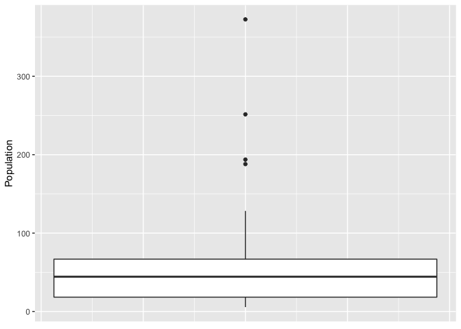
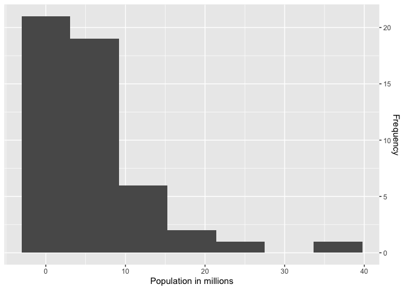
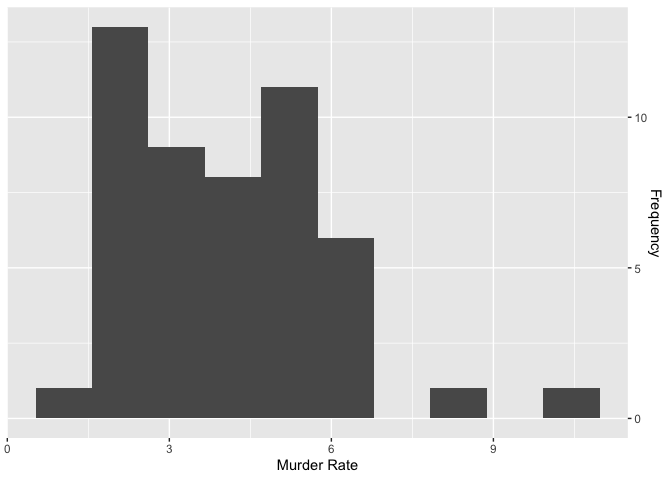

Chapter 1 - Exploratory Data Analysis
================

### Import the datasets needed for chapter 1

``` r
library(tidyverse)
```

Next we load all the data from the csv files.

``` r
state <- read_csv('psds_data/state.csv')
dfw <- read_csv('psds_data/dfw_airline.csv')
sp500_px <- read_csv('psds_data/sp500_px.csv')
sp500_sym <- read_csv('psds_data/sp500_sym.csv')
kc_tax <- read_csv('psds_data/kc_tax.csv')
lc_loans <- read_csv('psds_data/lc_loans.csv')
airline_stats <- read_csv('psds_data/airline_stats.csv')
```

``` r
head(state)
```

    ## # A tibble: 6 x 4
    ##   State      Population Murder.Rate Abbreviation
    ##   <chr>           <dbl>       <dbl> <chr>       
    ## 1 Alabama       4779736         5.7 AL          
    ## 2 Alaska         710231         5.6 AK          
    ## 3 Arizona       6392017         4.7 AZ          
    ## 4 Arkansas      2915918         5.6 AR          
    ## 5 California   37253956         4.4 CA          
    ## 6 Colorado      5029196         2.8 CO

#### Estimates of location

Now lets compute the mean and the median of the state pospulation.

``` r
print(mean(state$Population))
```

    ## [1] 6162876

``` r
print(mean(state$Population, trim = 0.1))
```

    ## [1] 4783697

``` r
print(median(state$Population))
```

    ## [1] 4436370

We can also find out the weighted mean.

``` r
weighted.mean(state$Murder.Rate, w = state$Population)
```

    ## [1] 4.445834

#### Estimates of variability

Variability or dispersion measures how close or spread out our data is.

IQR measure the difference between 75th and the 25th percentile

``` r
IQR(state$Population)
```

    ## [1] 4847308

Mean absolute deviation, measures the absolute value of the deviation
from the mean.

``` r
mad(state$Population)
```

    ## [1] 3849870

Since working with squared values is much easier than absolute values,
standard deviation is more commonly used in statistics.

``` r
sd(state$Population)
```

    ## [1] 6848235

The below code displays the percentile range for the murder rates.

``` r
quantile(state$Murder.Rate)
```

    ##     0%    25%    50%    75%   100% 
    ##  0.900  2.425  4.000  5.550 10.300

Boxplots are a quick way to visualize how our data is dispersed.

``` r
ggplot(state, aes(x = 1, y = Population/100000)) +
  geom_boxplot() +
  labs(y = 'Population') +
  theme(axis.title.x=element_blank(),
        axis.text.x=element_blank(),
        axis.ticks.x=element_blank())
```

<!-- -->

We can also divide the states into different bins based on their
populations.

``` r
state_abbr <- state %>%
  mutate(Population_freq = cut(Population, breaks = seq(min(Population),
                                                        max(Population),
                                                        length = 11),
                               right = TRUE,
                               include.lowest = TRUE)) %>%
  group_by(Population_freq) %>%
  summarize(state = paste(Abbreviation, collapse=","), .drop=FALSE) %>%
  complete(Population_freq, fill=list(state='')) %>%
  na.omit() %>%
  select(state)

state %>%
  mutate(Population_bins = cut(Population, breaks = seq(min(Population),
                                              max(Population),
                                              length = 11),
                     right = TRUE,
                     include.lowest = TRUE)) %>%
  group_by(Population_bins) %>% 
  summarise(freq = n()) %>%
  mutate(state = unlist(state_abbr)) %>%
  knitr::kable()
```

| Population\_bins      | freq | state                                                                   |
| :-------------------- | ---: | :---------------------------------------------------------------------- |
| \[5.64e+05,4.23e+06\] |   24 | AK,AR,CT,DE,HI,ID,IA,KS,ME,MS,MT,NE,NV,NH,NM,ND,OK,OR,RI,SD,UT,VT,WV,WY |
| (4.23e+06,7.9e+06\]   |   14 | AL,AZ,CO,IN,KY,LA,MD,MA,MN,MO,SC,TN,WA,WI                               |
| (7.9e+06,1.16e+07\]   |    6 | GA,MI,NJ,NC,OH,VA                                                       |
| (1.16e+07,1.52e+07\]  |    2 | IL,PA                                                                   |
| (1.52e+07,1.89e+07\]  |    1 | FL                                                                      |
| (1.89e+07,2.26e+07\]  |    1 | NY                                                                      |
| (2.26e+07,2.62e+07\]  |    1 | TX                                                                      |
| (3.36e+07,3.73e+07\]  |    1 | CA                                                                      |

We can display the above data in the form of a histogram.

``` r
state %>%
  ggplot(aes(x = Population/1000000)) +
  geom_histogram(bins = 7) +
  labs(x = 'Population in millions',
       y = 'Frequency') +
  scale_y_continuous(position = 'right')
```

<!-- -->

We can also display the density plot for the murder rates in USA.

``` r
state %>%
  ggplot(aes(x = Murder.Rate)) +
  geom_histogram(bins = 10) +
  labs(x = 'Murder Rate',
       y = 'Frequency') +
  scale_y_continuous(position = 'right')
```

<!-- -->
